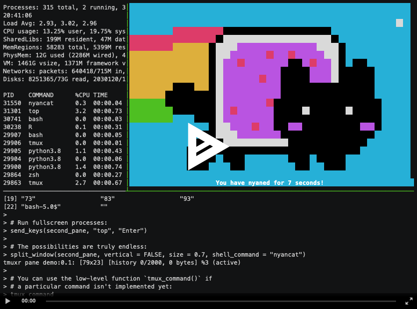

---
output:
  github_document:
    html_preview: false
---

<!-- README.md is generated from README.Rmd. Please edit that file -->

```{r, echo = FALSE}
knitr::opts_chunk$set(
  collapse = TRUE,
  comment = "#>",
  fig.path = "README-"
)
```

# tmuxr 

[](https://github.com/jeroenjanssens/tmuxr/actions)
[](https://codecov.io/gh/jeroenjanssens/tmuxr)
[](https://www.tidyverse.org/lifecycle/#stable)

## Overview

`tmuxr` is an R package that allows you to manage [tmux](https://github.com/tmux/tmux/wiki) and interact with the processes it runs. It features a pipeable API with which you can create, control, and capture tmux sessions, windows, and panes. 

## Demonstration

The recording below demonstrates various capabilities of `tmuxr` such as: running processes, sending keys, splitting windows, and capturing panes. Note that normally, managing tmux and the processes it runs is done in a detached mode, so you wouldn't see anything, but the result would be the same.

[](https://asciinema.org/a/325231)

Have a look at [the function reference](https://jeroenjanssens.github.io/tmuxr/reference/) to learn more about what `tmuxr` has to offer.

## Installation

`tmuxr` can be installed from this repository using `remotes`:

```{r, eval=FALSE}
# install.packages("remotes")
remotes::install_github("jeroenjanssens/tmuxr")
```

## Compatibility

We regularly test `tmuxr` on Ubuntu with tmux versions 2.1 through 3.1c and on macOS with the latest version of tmux provided by Homebrew. `tmuxr` might work on Windows using Cygwin or WSL, but we haven't tested this.

## License

The `tmuxr` package is licensed under the MIT License.
