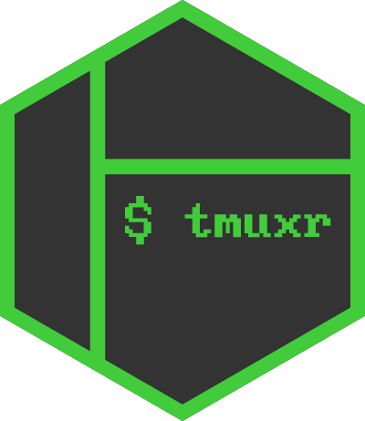

<!-- README.md is generated from README.Rmd. Please edit that file -->

# tmuxr 

[](https://github.com/datascienceworkshops/tmuxr/actions)
[](https://travis-ci.org/datascienceworkshops/tmuxr)
[](https://codecov.io/gh/datascienceworkshops/tmuxr)
[](https://www.tidyverse.org/lifecycle/#experimental)
[](https://cran.r-project.org/package=tmuxr)

## Overview

`tmuxr` is an R package that allows you to manage
[tmux](https://github.com/tmux/tmux/wiki) and interact with the
processes it runs. It features a pipeable API with which you can create,
control, and capture tmux sessions, windows, and panes.

## Demonstration

The recording below demonstrates various capabilities of `tmuxr` such
as: running processes, sending keys, splitting windows, and capturing
panes. Note that normally, managing tmux and the processes it runs is
done in a detached mode, so you wouldn’t see anything, but the result
would be the same.

<script id="asciicast-325231" src="https://asciinema.org/a/325231.js" async></script>

Have a look at [the
reference](https://datascienceworkshops.github.io/tmuxr/reference/) to
learn more about what `tmuxr` has to offer.

## Installation

`tmuxr` is available through CRAN and can be installed with
`install.packages("tmuxr")`. The package is under active development
though and the latest set of features can be obtained by installing from
this repository using `devtools`:

``` r
# install.packages("devtools")
devtools::install_github("datascienceworkshops/tmuxr")
```

## Compatibility

We [regularly test](https://travis-ci.org/datascienceworkshops/tmuxr)
`tmuxr` on Ubuntu with tmux versions 2.1 through 3.1b and on macOS with
the latest version of tmux provided by Homebrew. `tmuxr` might work on
Windows using Cygwin or WSL, but we haven’t tested this.

## License

The `tmuxr` package is licensed under the MIT License.
